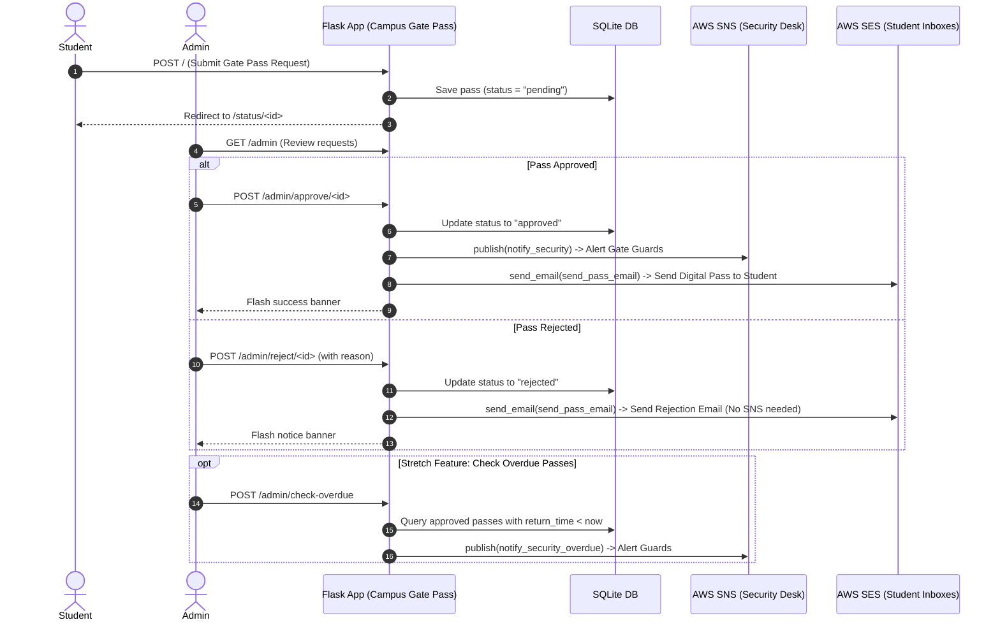

# 🏫 Campus Gate Pass System (AWS SNS + SES Demo)

A beginner-friendly Flask mini-project designed for live classroom and workshop teaching demonstrations. It demonstrates **Amazon Simple Notification Service (SNS)** and **Amazon Simple Email Service (SES)** working together in a realistic campus workflow.

---

## 🎯 Teaching Concept: Why Use Both SNS and SES?

A common question when learning AWS messaging is: *"Both send messages, so why do we need both?"*

| Feature / Service | **Amazon SNS** (Gate Security Desk) | **Amazon SES** (Student Notifications) |
|---|---|---|
| **Message Type** | Internal broadcast / alert (Pub/Sub) | High-fidelity transactional email |
| **Primary Audience**| Machine-to-machine, security desk, SMS subscribers | End-user / Customer (Students) |
| **Form Factor** | Short plaintext message / push / SMS | Rich HTML/Text email with pass details & instructions |
| **Routing Pattern** | 1-to-many fanout (multiple guards or endpoints receive 1 publish) | 1-to-1 point-to-point delivery to a specific inbox |
| **Campus Gate Pass Usage** | Triggered on **Pass Approval** & **Overdue Check** to immediately notify the gate security desk | Triggered on **Pass Approval** & **Pass Rejection** to inform the student directly |

---

## 🔄 Workflow Architecture



---

## 🚀 AWS Console Setup Guide

### 1. Amazon SNS Setup (Security Desk Topic)
1. Open the **AWS Management Console** and navigate to **Amazon SNS** (ensure your target region is selected, e.g., `us-east-1`).
2. Go to **Topics** &rarr; click **Create topic**.
3. Select **Standard** type.
4. Name: `campus-security-gate-alerts`.
5. Click **Create topic**.
6. Under the new topic, click **Create subscription**:
   - **Protocol**: Choose `Email` or `SMS` (for live demo, your personal email or phone).
   - **Endpoint**: Enter your email address or phone number.
   - Click **Create subscription**.
   - *(If Email protocol)*: Check your inbox and click **Confirm subscription**.
7. Copy the **Topic ARN** (e.g., `arn:aws:sns:us-east-1:123456789012:campus-security-gate-alerts`).

---

### 2. Amazon SES Setup (Verified Identities)
1. Open **Amazon SES** in the AWS Console.
2. In the left navigation, click **Identities** (or **Verified identities**).
3. Click **Create identity**:
   - Select **Email address**.
   - Enter your sender email (e.g., `security-office@yourdomain.com` or your personal testing email).
   - Click **Create identity**.
4. Check your inbox for the Amazon SES verification email and click the confirmation link.
5. **Important Note regarding SES Sandbox**:
   - Brand-new AWS accounts operate in **SES Sandbox mode**.
   - In Sandbox mode, you can only send emails to **verified email addresses**.
   - Therefore, also verify the student email address you intend to use during your classroom demo, or use your own verified email in the student request form.

---

### 3. IAM Permissions Required
Ensure the AWS credentials configured on your machine have the following minimum IAM policies:
- `sns:Publish` on the SNS Topic ARN.
- `ses:SendEmail` on the SES identity.

---

## 💻 Local Setup & Execution

### Step 1: Clone & Navigate
```bash
git clone <repo-url>
cd "Campus Gate Pass System"
```

### Step 2: Create a Virtual Environment & Install Dependencies
```bash
python -m venv venv

# On Windows:
venv\Scripts\activate

# On macOS/Linux:
source venv/bin/activate

pip install -r requirements.txt
```

### Step 3: Configure Environment Variables
Copy `.env.example` to `.env`:
```bash
cp .env.example .env
```
Edit `.env` with your actual AWS settings:
```env
AWS_REGION=us-east-1
AWS_ACCESS_KEY_ID=AKIA...
AWS_SECRET_ACCESS_KEY=...
SNS_TOPIC_ARN=arn:aws:sns:us-east-1:123456789012:campus-security-gate-alerts
SES_SENDER_EMAIL=your-verified-sender@example.com
SECRET_KEY=super-secret-flask-key
```

> **Offline / Safe Simulation Mode:**
> If you run the app without setting real AWS credentials or leave default sample ARNs, the app gracefully falls back to simulated SNS and SES log messages. The entire flow and UI can be demonstrated even offline!

### Step 4: Run the Application
```bash
python app.py
```
Open your browser and navigate to:
- **Student Request Form:** [http://127.0.0.1:5000/](http://127.0.0.1:5000/)
- **Admin Dashboard:** [http://127.0.0.1:5000/admin](http://127.0.0.1:5000/admin)

---

## 📂 File Structure

```text
Campus Gate Pass System/
├── .env.example           # Template for AWS & Flask environment variables
├── requirements.txt       # Python dependencies (Flask, boto3, python-dotenv)
├── app.py                 # Core Flask routes & SQLite database handlers
├── sns_utils.py           # Boto3 SNS client & alert publishing routines
├── ses_utils.py           # Boto3 SES client & transactional email routines
├── README.md              # Project guide, AWS concept breakdown & demo steps
├── static/
│   └── style.css          # Clean, high-contrast responsive styling
└── templates/
    ├── base.html          # Base layout with navbar & flash alerts
    ├── index.html         # Student pass application form
    ├── status.html        # Digital gate pass status screen
    └── admin.html         # Admin approval dashboard & overdue scanner
```

---

## 🧪 Live Demo Flow for Instructors

1. **Submit Pass as Student:** Go to `/`, submit a pass request for "John Doe" with return time set to earlier today (e.g. `10:00` AM) or future.
2. **Show Status Page:** Note that the status displays `PENDING REVIEW`.
3. **Open Admin Dashboard:** Go to `/admin`.
4. **Approve Pass:** Click **Approve (SNS+SES)**. Point out the flash message confirming:
   - Security Desk alert dispatched via SNS
   - Confirmation email dispatched to the student via SES
5. **Check Overdue Passes (Stretch Feature):** Click **Check Overdue Passes**. Show students how passes with expired return times automatically trigger urgent security desk alerts via SNS.
6. **Reject a Pass:** Submit another test request, then reject it with reason *"Curfew restrictions apply"*. Emphasize to students that only SES is called (no SNS), keeping security channel noise-free.
